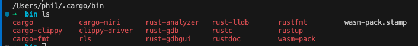

# getting started with rust

## contents

- [getting started with rust](#getting-started-with-rust)
  - [contents](#contents)
  - [installation](#installation)
  - [rust version](#rust-version)
  - [updating rust](#updating-rust)
  - [hello world](#hello-world)
  - [anatomy of a program](#anatomy-of-a-program)
  - [macros](#macros)
  - [Cargo rust package manager](#cargo-rust-package-manager)
  - [building a rust application with `cargo`](#building-a-rust-application-with-cargo)
  - [cargo check](#cargo-check)
  - [cargo build --release](#cargo-build---release)

## installation

following this guide here

https://doc.rust-lang.org/book/ch01-01-installation.html

```bash
curl --proto '=https' --tlsv1.2 https://sh.rustup.rs -sSf | sh
# Rust is installed now
```

```bash
# To get started you may need to restart your current shell.
# This would reload your PATH environment variable to include
# Cargo's bin directory ($HOME/.cargo/bin).
```

so ... to check ... we can first check out `$HOME/.cargo/bin`



we can also check out the $PATH variable

```bash
echo "${PATH//:/\n}"
```

and we see one of the lines is indeed matching to the rust cargo path

```bash
/Users/phil/.cargo/bin
```

so this means that rust is installed properly on our system now.

happy days!

on a MAC computer as well we must ensure we have the C compiler tools installed

```bash
xcode-select --install
# Command line tools are already installed
```

also be aware extra rust tools are installed at this location also

```bash
/Users/phil/.rustup
```


## rust version

```bash
rustc --version
# rustc 1.83.0 (90b35a623 2024-11-26)
```

## updating rust

```bash
rustup update
```


## hello world

```bash
cargo new hello-world-01
```

this creates a structure

```
Cargo.toml
src
  main.rs
```

with `Cargo.toml` having

```rs
[package]
name = "hello-world-01"
version = "0.1.0"
edition = "2021"

[dependencies]
```

and `main.rs` having

```rs
fn main() {
    println!("Hello, world!");
}
```

to compile the program we run

```bash
rustc main.rs
# creates file `main`
```

to run this new file `main` we then type

```bash
./main
# Hello, world!
```

note that this compiled file `main` does not require rust to be installed to run it - it is a native of the operating system, not related in any way to rust!  so it can be distributed and run on any similar system, in this case a MAC.

## anatomy of a program

`main()` is the entry point

```rs
fn main() {

}
```

to adhere to standard formatting we can run

```bash
rustfmt main.rs
```

which will adjust the formatting - try amending the formatting of your code and then running this command to see the effect

## macros

`println!` calls a `rust macro`

`doThis` calls a `rust function`


## Cargo rust package manager

`cargo` is the equivalent of `npm` and helps handle libraries

```bash
cargo --version
# cargo 1.83.0 (5ffbef321 2024-10-29)
```

the `cargo` file is in the `TOML` sytax where `TOML` stands for `Tom’s Obvious, Minimal Language` ((very inspirational and intuitive name, huh!))

## building a rust application with `cargo`

to build a rust application with `cargo` we run

```bash
cargo build
# Compiling hello-world-01 v0.1.0 (/Users/phil/github/rust/projects/hello-world/hello-world-01)
# Finished `dev` profile [unoptimized + debuginfo] target(s) in 0.67s
```

we now see `Cargo.lock` which is similar to `package.lock` ie just helps the application know exactly which versions of the libraries are in use at the time of compiling which ensures compatibility of all the libraries when running the code.

We also see `target/debug` directory containing the compiled output `hello-world-01` binary file which again can be run manually using

```bash
./hello-world-01
# Hello, world!
```

or using `cargo run` from the root directory

```bash
cargo run
# Running `target/debug/hello-world-01`
# Hello, world!
```

## cargo check

also verifies code is good to go, without the extra step of creating the executable.  this can be useful for larger programs, if we just continually want feedback that our program is compiling well, as we are building it.

```bash
cargo check
```

## cargo build --release

for production we run

```bash
cargo build --release
```

this now creates a `release` folder inside `target` and we can run the app using

```bash
cargo run --release
```


